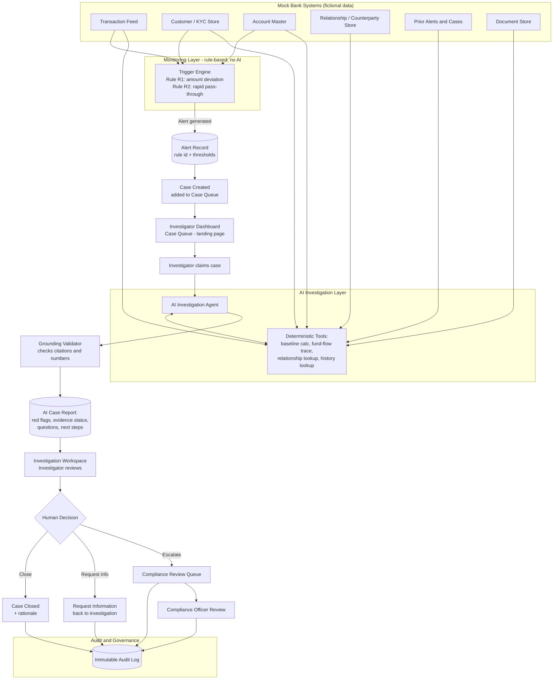

# Flowchart 1 — End-to-End Data Flow

**Product:** Sentinel AML
**How to use this file:** Copy the code block below into [mermaid.live](https://mermaid.live), the Mermaid VS Code extension, or draw.io's "Insert > Mermaid" option to get a rendered, editable diagram for the blueprint document and the slide deck.

Shows: how a transaction becomes a trigger, how a trigger becomes a case, how the AI agent assembles evidence, and how the case reaches a human decision and the audit log.

## Reading Notes for the Blueprint / Deck

- The **Monitoring Layer** is deliberately rules-only — no AI/LLM involvement in raising the alert. This is worth calling out on the slide: it shows the team understood not every step should use GenAI (see [06-Technical-Architecture.md](06-Technical-Architecture.md) §1, §4).
- The **AI Investigation Layer** never writes back to source data — tools are read-only (see [08-Integration-and-API-Specifications.md](08-Integration-and-API-Specifications.md) §1).
- Every path out of "Human Decision" ends in the **Audit and Governance** block — this is the diagram's visual proof of the human-in-the-loop guarantee.
- Cross-reference: [Flowchart-2-Investigation-Process-Flow.md](Flowchart-2-Investigation-Process-Flow.md) zooms into the "Investigation Workspace -> Human Decision" portion of this diagram.
