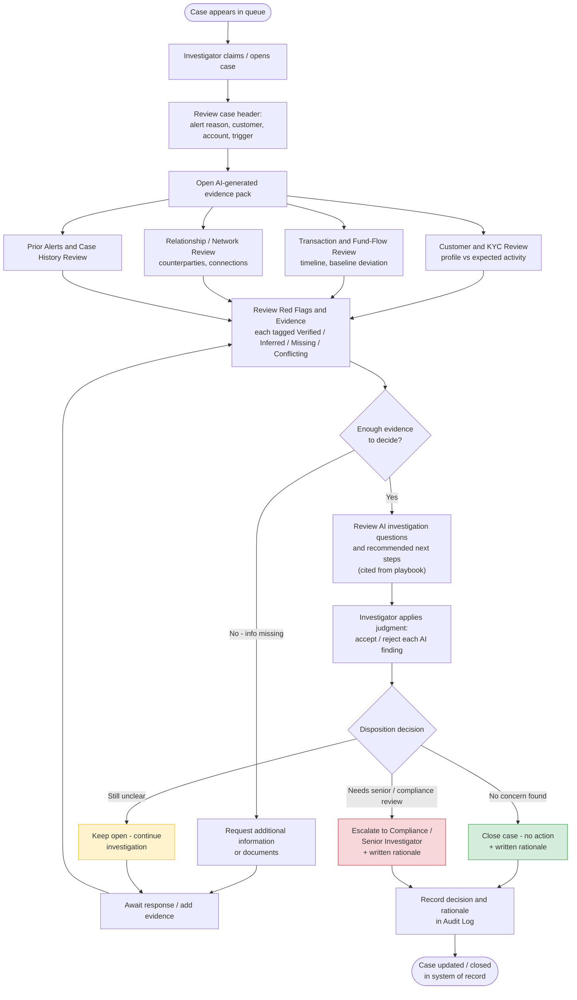

# Flowchart 2 — Investigation Process Flow

> **Historical target-state diagram, not an implementation screenshot.** The current prototype allows a human to request more information and record a rationale, but it does not provide a document-request/response workflow that loops new evidence back into the case or update a bank system of record. “Claim case” is not a production assignment control. Correct this Mermaid diagram before using it in the final presentation; see [17-Repository-File-Audit.md](17-Repository-File-Audit.md) for the verified scope.

**Product:** Sentinel AML
**How to use this file:** Copy the code block below into [mermaid.live](https://mermaid.live), the Mermaid VS Code extension, or draw.io's "Insert > Mermaid" option to get a rendered, editable diagram.

Shows: the investigator's journey through a single case, once it has landed in the queue — this is the zoomed-in view of the "Investigation Workspace -> Human Decision" part of [Flowchart-1-End-to-End-Data-Flow.md](Flowchart-1-End-to-End-Data-Flow.md).

## Reading Notes for the Blueprint / Deck

- The loop **FLAGS -> QCHECK -> REQINFO -> WAIT -> FLAGS** is the "Missing evidence" path — it shows the product doesn't force a decision when information is genuinely absent (see the Missing evidence-status requirement in [05-Functional-Requirements-and-Use-Case-Document.md](05-Functional-Requirements-and-Use-Case-Document.md) and [11-Acceptance-Criteria-and-Definition-of-Done.md](11-Acceptance-Criteria-and-Definition-of-Done.md)).
- **JUDGE** ("accept / reject each AI finding") is the step that makes the human-in-the-loop real rather than nominal — the investigator isn't just clicking "approve," they are individually accepting or rejecting each finding.
- The three colored outcomes (green = close, red = escalate, yellow = keep open) map directly to the Human Decision Panel actions in [09-UI-Wireframes-and-Screen-Designs.md](09-UI-Wireframes-and-Screen-Designs.md) Screen 3.
- Walking through this diagram live with case **C1** (ends in Escalate) and then case **C2** (ends in Close) on the same rule trigger is the single strongest 5 minutes of the demo — see [05-Functional-Requirements-and-Use-Case-Document.md](05-Functional-Requirements-and-Use-Case-Document.md) §1.
