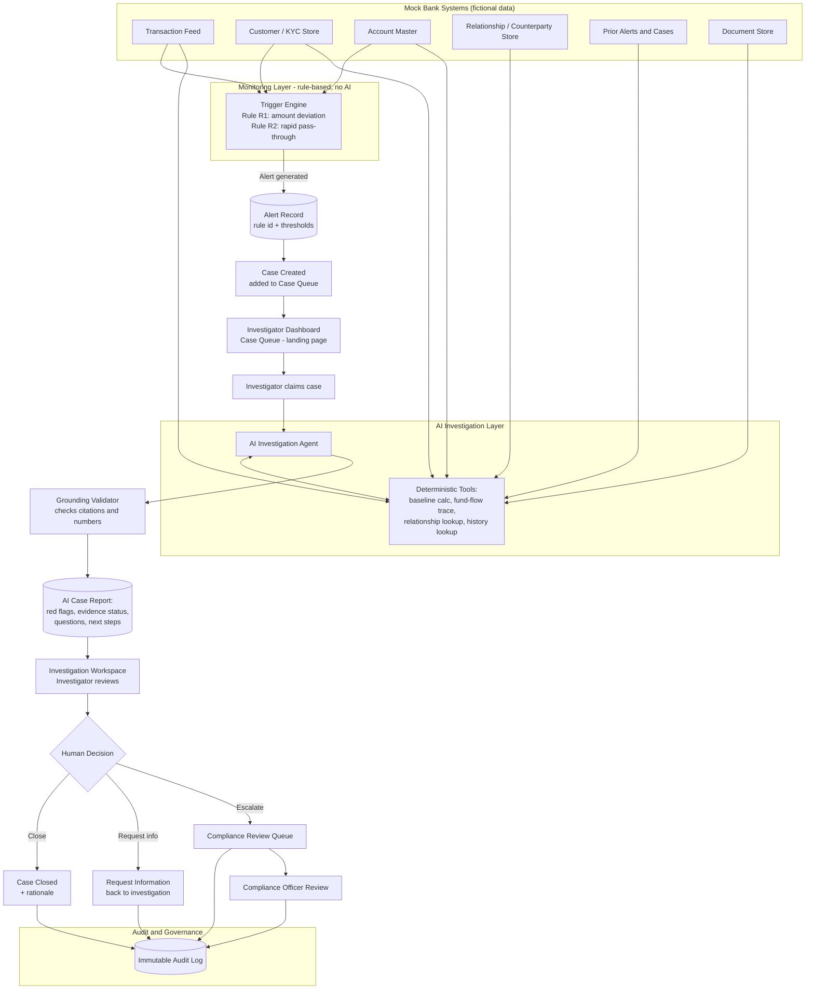
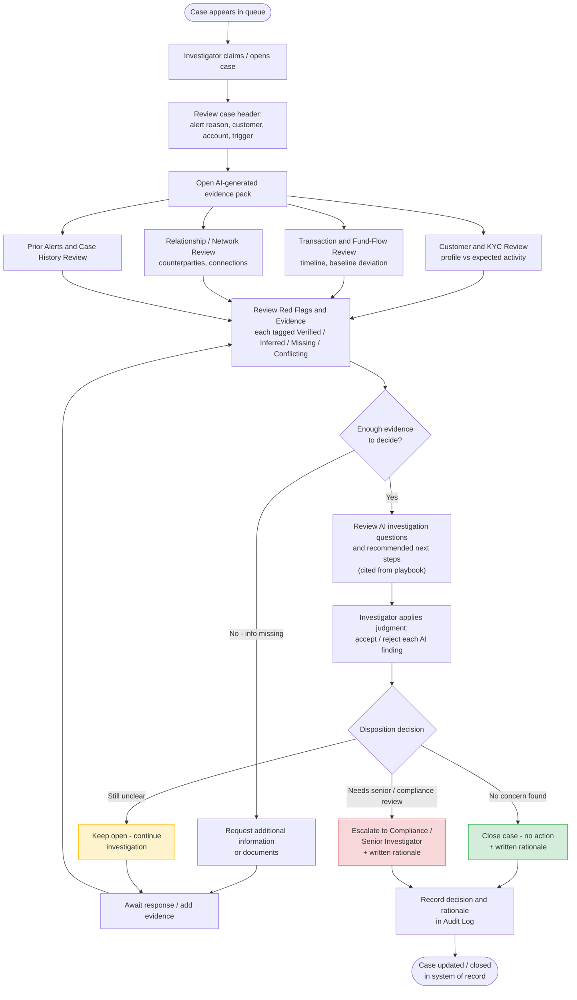

# Sentinel AML — Blueprint & Product Requirements Document

**AI-Assisted AML Detection & Investigation Platform**
**Capstone Project — Leadership with AI, IIT Mumbai**

Prepared by: [Team names — fill in]
Date: 27 September 2026
Status: Draft — open items pending team confirmation (see Section 16)

> All customer, account, and transaction data referenced anywhere in this document is fictional, created for demonstration purposes only. This document does not represent a production AML compliance system.

---

## Table of Contents

1. Project Vision & Business Case
2. Product Requirements Document (PRD)
3. User Personas & Stakeholders
4. Current Process / Workflow
5. Functional Requirements & Use-Case Document
6. Technical Architecture
7. Data Requirements
8. Integration / API Specifications
9. UI Wireframes / Screen Designs
10. Non-Functional Requirements
11. Acceptance Criteria / Definition of Done
12. Flowchart 1 -- End-to-End Data Flow
13. Flowchart 2 -- Investigation Process Flow
14. Risks, Assumptions, Dependencies & Constraints
15. Delivery Plan / Milestone Roadmap
16. Meeting Notes and Decisions (Open Items Log)

---

---

# 1. Project Vision & Business Case
**Product:** Sentinel AML — AI-Assisted AML Detection & Investigation Platform
**Tagline:** From transaction to trigger to traceable decision.
**Document owner:** [assign]
**Status:** Draft for team review — capstone academic project, fictional data only

---

## 1. Purpose

Sentinel AML is an end-to-end product, not a chatbot. It watches a bank's transaction activity, automatically **detects** patterns that warrant investigation, and gives an AML investigator an **AI-assisted workspace** to investigate the case — evidence gathered, connections traced, red flags identified, and a structured report drafted — while the human investigator retains every decision.

It has three moving parts a reader should picture immediately:
1. **A trigger.** Something happens in the transaction feed that the system is watching for.
2. **A landing experience.** The investigator opens the product and sees a queue of cases, not a blank chat box.
3. **An investigation.** The AI assembles the evidence; the human decides.

## 2. Business Problem

Financial institutions must review transaction-monitoring alerts for possible money laundering. Today this review is manual: an investigator opens 6–8 separate systems (core banking, KYC, case management, screening tools) to piece together the customer's history, trace where money went, check for related parties, and write up findings. This is slow, inconsistent between investigators, and hard to audit after the fact.

Two consequences of the status quo:
- **Investigation backlog and inconsistent quality** — investigators spend most of their time compiling evidence rather than applying judgment.
- **Weak traceability** — when a regulator or auditor asks "how was this decided," the answer is scattered across systems and inboxes.

## 3. Business Case (why build this)

| Driver | Current state (assumption, to validate with real data if this goes beyond the capstone) | Target state |
|---|---|---|
| Time per alert | Investigator manually compiles evidence across systems — assumed several hours per moderately complex case | AI assembles the evidence pack in minutes; investigator spends time on judgment, not compilation |
| Consistency | Write-ups vary by investigator | Structured report format every time, same evidence categories |
| Auditability | Evidence trail reconstructed after the fact from emails/notes | Every AI action and human decision logged automatically as it happens |
| Missed connections | Related accounts / prior alerts easy to miss under time pressure | System explicitly traces fund flow and relationships, and lists what is missing |

**All time/effort figures above are illustrative assumptions for the capstone, not measured data**, and are flagged as such throughout this pack (see **Section 14 — Risks, Assumptions, Dependencies & Constraints**).

## 4. Vision Statement

> Give every AML investigator a case that already has its evidence gathered, its connections traced, and its open questions written down — so their first hour on a case is spent deciding, not searching.

## 5. Who This Is For

See **Section 3 — User Personas & Stakeholders** for full detail. In short: AML Investigators (primary users), Investigation Team Leads, Compliance Officers, and a System Admin role for rule/threshold configuration.

## 6. Scope of This Capstone

### In scope
- A rule-based **trigger engine** that scans a mock transaction feed and raises alerts (no AI in this layer — deliberately rules-based; see **Section 6 — Technical Architecture**).
- A **case queue landing page** (the product's home screen after login).
- An **AI-assisted investigation workspace** for one frozen scenario family: *sudden high-value credit followed by rapid movement of funds*, demonstrated with a suspicious case and a legitimate "twin" case (see **Section 5 — Functional Requirements & Use-Case Document**).
- A **human decision layer**, kept visually and structurally separate from AI output.
- A **light escalation queue** for a Compliance role.
- A **full audit log** of AI actions and human decisions.
- All data is **fictional / mock**, clearly labelled throughout the product and documentation.

### Out of scope
- Real integrations with core banking, KYC providers, credit/sanctions bureaus, or case-management systems.
- Automated regulatory filing (STR/CTR) or any AI-made legal/criminal determination.
- Full identity and access management, production-grade security certification, multi-jurisdiction support.
- Every AML typology — only the frozen scenario family above, plus documented extension points.

## 7. Success Measures (for the capstone demo, not a production KPI set)

| Measure | Target for demo |
|---|---|
| End-to-end story is demonstrable live | Trigger fires → case appears in queue → AI report generated → investigator decision recorded → audit entry visible |
| Twin-case distinction is clear | Suspicious case (C1) and legitimate case (C2) produce visibly different AI findings from the same trigger rule |
| Every AI claim is traceable | 100% of AI findings cite an underlying mock record or are labelled Missing/Inferred |
| Human boundary is visible | No screen implies the AI decided the case; every disposition requires a human action + rationale |

Production-style KPIs (turnaround time, false-positive rate, adoption) belong in the roadmap document (**Section 15 — Delivery Plan / Milestone Roadmap**) as **forward-looking targets**, not measured results.

## 8. Budget & Timeline Assumptions

This is an **academic capstone**, not a funded product build.

- **Team:** 7 members (see **Section 3 — User Personas & Stakeholders** for the team roster and role split, and the team plan workbook for the task-level split).
- **Timeline:** submission window is the 1st–2nd week of October 2026; working backward, internal freeze target is ~6 October 2026 (adjust once the exact date is confirmed).
- **Budget:** none — uses free/low-cost LLM API tier, open-source libraries, mock data. Any live LLM API cost is the only real spend, kept small by caching demo responses (see **Section 6 — Technical Architecture**).
- **Effort assumption:** a working prototype covering the in-scope items above, not a production system.

## 9. What "Done" Looks Like for This Capstone

A submitted blueprint document, a slide deck, and a running (or reliably screen-recorded) prototype that together show: a transaction pattern gets detected → an investigator opens the case in a real product screen → the AI has already assembled evidence and flagged what's missing → the investigator makes and records the decision → the whole thing is logged. See **Section 11 — Acceptance Criteria / Definition of Done** for the checklist version.

---

# 2. Product Requirements Document (PRD)
**Product:** Sentinel AML
**Related:** **Section 1 — Project Vision & Business Case**, **Section 5 — Functional Requirements & Use-Case Document**

---

## 1. Product Overview

Sentinel AML has two halves that together make it a product rather than a single AI feature:

1. **Detect** — a rule-based Trigger Engine continuously scans transaction activity and raises alerts when defined conditions are met.
2. **Investigate** — an AI-assisted workspace turns each alert into a structured, evidence-linked case for a human investigator to review and decide.

## 2. Features

| ID | Feature | Description | Priority |
|---|---|---|---|
| F1 | Login / role landing | Role-based entry (Investigator, Team Lead, Compliance, Admin); mock auth for prototype | Must |
| F2 | Case queue dashboard | Landing page after login: open cases, priority, alert type, SLA/age, quick filters | Must |
| F3 | Trigger engine | Background rule evaluation over mock transaction feed; generates alerts with rule ID + threshold values shown | Must |
| F4 | Case intake | Alert becomes a case; claimed by an investigator | Must |
| F5 | Investigation workspace | Case header, alert summary, transaction timeline, fund-flow/relationship view, AI findings panel, investigation questions, recommended next steps | Must |
| F6 | Evidence status tagging | Every AI finding tagged Verified / Inferred / Missing / Conflicting with citations | Must |
| F7 | Human decision panel | Separate UI region; actions = request info / add evidence / escalate / close; rationale mandatory | Must |
| F8 | Audit log | Immutable, per-case and system-wide log of AI actions and human decisions | Must |
| F9 | Escalation / compliance queue | Escalated cases appear in a Compliance role view | Should |
| F10 | Admin rule configuration (light) | View/adjust the two trigger rule thresholds; view/edit playbook | Should |
| F11 | Twin-case scenario library | Pre-loaded suspicious case (C1) and legitimate case (C2) sharing the same trigger, for demo and testing | Must |
| F12 | Cached / live report toggle | AI report can replay from cache (demo reliability) or regenerate live | Should |
| F13 | Second trigger scenario (velocity/structuring) | Additional rule + case for variety | Could |
| F14 | Network graph visualization | Visual account/fund-flow graph in the workspace | Could |

MoSCoW note: **Must** = required for capstone demo/acceptance; **Should** = strengthens the demo, build if time allows; **Could** = stretch, defer to roadmap if short on time. See **Section 15 — Delivery Plan / Milestone Roadmap**.

## 3. Business Rules

| # | Rule |
|---|---|
| BR1 | The AI never sets, changes, or recommends a final legal/criminal determination. It surfaces indicators and evidence status only. |
| BR2 | Every AI finding must cite the record(s) it is based on. A finding with no citation is not permitted in the output. |
| BR3 | "Verified" may only be used when the underlying data directly supports the claim; anything inferred from multiple data points is "Inferred," never "Verified." |
| BR4 | Case disposition (close/escalate) is a human action only, and requires a written rationale before it can be recorded. |
| BR5 | The Trigger Engine is rule-based only — no AI/LLM involvement in raising an alert (keeps detection deterministic and explainable). |
| BR6 | AI tools are read-only against the mock data store. The AI cannot alter alert status, transaction records, or KYC data. |
| BR7 | Recommended next steps must cite a playbook entry (mock internal procedure), never be generated from the model's unstated assumptions about regulation. |
| BR8 | All data, customers, accounts, and transactions are fictional; the product must visibly label itself as a prototype using mock data on every screen. |

## 4. Out-of-Scope Items (explicit)

- Real-time payment blocking or transaction interdiction.
- Regulatory report (STR/CTR) generation or submission.
- Full KYC onboarding / remediation workflow.
- Automatic case closure without human action.
- Any claim that the product performs a legal or definitive AML determination.
- Production identity/access management, encryption-at-rest infrastructure, and security certification (documented as target-state requirements only — see **Section 10 — Non-Functional Requirements**).

## 5. Assumptions

- One institution, one jurisdiction context (India) for terminology and illustrative scenario framing; no jurisdiction-specific legal claims are made (see **Section 14 — Risks, Assumptions, Dependencies & Constraints**).
- A single LLM provider with tool-calling and JSON-schema output is available to the team (provider/key TBD by team — open item, see Meeting Notes).
- Prototype runs locally / on a shared demo machine; no production hosting required.

## 6. Dependencies

- Mock dataset (customers, accounts, transactions, relationships, alerts, documents, playbook) — see **Section 7 — Data Requirements**.
- LLM API access — see **Section 8 — Integration / API Specifications**.

## 7. Release Criteria

See **Section 11 — Acceptance Criteria / Definition of Done**.

---

# 3. User Personas & Stakeholders
**Product:** Sentinel AML

---

## 1. Personas (who uses the product)

### Persona 1 — AML Investigator (primary user)
- **Role in product:** Reviews assigned cases in the investigation workspace, works through evidence, makes and records decisions.
- **Goals:** Close/escalate cases accurately and quickly; avoid missing real red flags; avoid over-flagging legitimate activity.
- **Pain today:** Compiling evidence across systems is slow; hard to be sure nothing was missed; write-ups are inconsistent across the team.
- **What Sentinel AML gives them:** A pre-assembled, cited evidence pack, explicit "missing information" list, and a structured decision panel with mandatory rationale.
- **Primary screens:** Case queue, Investigation workspace, Human decision panel.

### Persona 2 — Investigation Team Lead
- **Role in product:** Monitors team caseload, reassigns cases, reviews quality on a sample basis.
- **Goals:** Balance workload, meet SLA, spot inconsistent decisions.
- **Primary screens:** Case queue (team view), Audit log.

### Persona 3 — Compliance Officer (MLRO-delegate view)
- **Role in product:** Reviews escalated cases only; does not use the AI investigation workspace directly for routine cases.
- **Goals:** Confirm escalation is warranted; decide on further action (outside product scope — regulatory filing is manual/out of scope).
- **Primary screens:** Escalation / compliance queue, Audit log, case read view.

### Persona 4 — System Admin (light role)
- **Role in product:** Configures the two trigger-engine rule thresholds; manages the mock playbook; manages user role assignment (mock auth).
- **Goals:** Keep detection rules current; keep next-step guidance (playbook) accurate.
- **Primary screens:** Admin / rule configuration.

### Persona 5 — Capstone Presenter / Demo Viewer (prototype-only persona)
- **Role in product:** Not a real product persona — represents the evaluator watching the 15-minute demo.
- **Goals:** Quickly understand what triggers detection, how AI helps, and where the human decides.
- **Implication for design:** The product must be legible to a first-time viewer within minutes — favors a visible trigger moment and a clearly separated AI vs. human panel (see **Section 9 — UI Wireframes / Screen Designs**).

## 2. Stakeholder List

| Stakeholder | Interest | Involvement |
|---|---|---|
| Capstone team (7 members) | Build, present, and be evaluated on the product | Build/approve everything in this pack |
| IIT Mumbai faculty / evaluation panel | Assess against the rubric (problem relevance, process understanding, data-driven design, AI appropriateness, architecture, guardrails, roadmap, value logic, communication) | Approves the submission (evaluator, not a build stakeholder) |
| (Illustrative, for blueprint realism) Bank AML Operations Head | Would own the business case in a real deployment | Referenced in blueprint governance/roadmap sections only — not a real contact for this capstone |
| (Illustrative) Bank Compliance / MLRO function | Would own escalation policy and final regulatory decisions in a real deployment | Referenced for the Human Decision boundary and escalation design only |
| (Illustrative) Bank IT / Data Owners | Would own real source systems in a real deployment | Referenced in Data Requirements as the target-state source of truth; capstone uses mock data instead |

**Note:** The bank-side stakeholders above are illustrative — used to keep the blueprint realistic — not actual people the team has consulted. This is stated plainly so the document is not misread as claiming real institutional engagement.

## 3. RACI (who does what on this decision layer)

| Decision | Responsible | Accountable | Consulted | Informed |
|---|---|---|---|---|
| Close a case with no findings | Investigator | Investigator | — | Team Lead |
| Escalate a case | Investigator | Investigator | Team Lead (optional) | Compliance |
| Accept escalation, decide further action | Compliance Officer | Compliance Officer | Investigator | Team Lead |
| Change trigger-rule thresholds | Admin | Team Lead | Investigators (feedback on false positives) | Compliance |
| Update the mock playbook | Admin | Team Lead | Investigators | — |

This RACI illustrates the governance model the blueprint recommends (see **Section 6 — Technical Architecture** and blueprint governance section); the prototype simulates it with role-based views rather than real approval workflows.

---

# 4. Current Process / Workflow
**Product:** Sentinel AML — describes the **as-is** (today, without the product) process this capstone targets.

---

## 1. As-Is Process Narrative

1. A bank's transaction-monitoring platform (existing system, out of scope to rebuild) applies rules across all transactions and raises an alert when a rule fires.
2. The alert lands in a case-management queue, typically with minimal context (customer ID, account ID, rule name).
3. An investigator is assigned or claims the case.
4. The investigator manually:
   - opens the core banking / CRM system to review customer and KYC details
   - opens the transaction system to pull recent history and compute (by eye or spreadsheet) whether the flagged activity is unusual
   - checks internal systems or spreadsheets for related accounts and counterparties
   - searches for prior alerts or cases involving the customer or counterparties
   - reviews any supporting documents already on file
   - manually writes an investigation summary, usually in a free-text case note or a Word/Excel template
5. The investigator decides: close (no concern), request more information, or escalate to a senior investigator / compliance.
6. The decision and rationale are recorded, typically as free text, in the case management system.
7. Audit trail exists only insofar as the case management system logs status changes; the evidence trail itself is reconstructed from notes, screenshots, and emails if ever revisited.

## 2. Pain Points (mapped to what Sentinel AML addresses)

| Pain point | Effect | Addressed by |
|---|---|---|
| Evidence scattered across 4–6 systems | Time-consuming compilation before analysis can even start | AI Investigation Workspace pulls all evidence into one screen (mock data in prototype) |
| No structured way to say "I don't have this information" | Gaps get missed or silently assumed away | Explicit **Missing** evidence-status category |
| Free-text write-ups vary investigator to investigator | Inconsistent quality, hard to review | Structured case report template, same fields every time |
| Hard to reconstruct "what was known when" | Weak defensibility on audit/regulatory review | Full audit log of AI actions and human decisions, timestamped |
| Investigators may treat every large transaction as suspicious (or the reverse — alert fatigue) | Both over- and under-investigation risk | Twin-case design (C1 suspicious / C2 legitimate) built into the product's evidence logic — see **Section 5 — Functional Requirements & Use-Case Document** |
| No visible link between "why was this flagged" and "what should I check" | Investigator has to independently reconstruct the rule logic | Trigger Engine shows the exact rule and threshold that fired, attached to the case |

## 3. Approvals, Exceptions, and Handoffs (as-is, and how the product maps to them)

| Step | Who approves / handles today | Product equivalent |
|---|---|---|
| Alert generated | Automatic (existing monitoring system) | Trigger Engine (rule-based, F3) |
| Case assignment | Team lead / queue auto-assignment | Case queue dashboard (F2/F4) |
| Evidence gathering | Investigator, manual | AI Investigation Workspace (F5/F6) |
| Request for more information | Investigator emails/calls relevant teams | "Request information" action (F7) — logged, outcome manually re-entered by investigator (integration out of scope) |
| Escalation | Investigator flags to senior/compliance manually | Escalation queue (F9) |
| Final regulatory decision (e.g., filing) | Compliance/MLRO, outside the investigator's system entirely | **Out of scope** — product stops at escalation hand-off |

## 4. Future-State Summary (delta this product introduces)

The future-state process is identical in its decision authority (human investigator and compliance retain every consequential decision) but compresses steps 4–6 above from a multi-system manual exercise into a single AI-assembled workspace with mandatory citation and status tagging. See the two flowcharts:
- **Section 12 — Flowchart 1 -- End-to-End Data Flow**
- **Section 13 — Flowchart 2 -- Investigation Process Flow**

---

# 5. Functional Requirements & Use-Case Document
**Product:** Sentinel AML
**Related:** **Section 2 — Product Requirements Document (PRD)**

---

## 1. Frozen Use Case

**Scenario family:** Sudden high-value credit followed by rapid movement of funds.

**One-line statement:** An AI assistant that turns an AML alert for rapid movement of a large credit into an evidence-backed investigation package, while the human investigator keeps the decision.

**Two demonstration cases sharing the same trigger rules:**

| Case | Story | Outcome the demo shows |
|---|---|---|
| **C1 — Suspicious** | Customer with a small, steady transaction history suddenly receives ₹1 crore from an unrelated/unknown-relationship counterparty; ~86% moves out within 48 hours across 3 accounts (one hop external, thin data) | Multiple Verified red flags, several Missing items (no KYC on external hop accounts, undeclared source of funds), no counter-evidence on file |
| **C2 — Legitimate twin** | Same size and speed of movement, but the credit is a documented property-sale payment and the outbound transfer is to a verified family member, with a sale deed on file | Same trigger fires (amount deviation), but Verified counter-evidence is present; AI still lists the same category of red flag but with contrary evidence attached, and a lower recommended review priority — the human still decides |

## 2. Alert Trigger Definitions

| Rule ID | Name | Condition | Fires for |
|---|---|---|---|
| R1 | Amount deviation | Single incoming credit ≥ 5× the account's trailing 6-month average credit amount | C1, C2 |
| R2 | Rapid pass-through | ≥ 80% of a flagged credit's value leaves the receiving account within 72 hours, across ≥ 2 outbound transactions/hops | C1, C2 |

Both rules must fire to create a case in the default demo configuration (reduces noise); thresholds are configurable by the Admin role (F10).

## 3. Step-by-Step Use Case: "Investigate a rapid-movement alert"

**Actor:** AML Investigator
**Precondition:** Trigger Engine has raised an alert (R1 + R2 fired) and a case exists in the queue.

| Step | User action | System response | Validation / error handling |
|---|---|---|---|
| 1 | Investigator opens case queue (landing page) | Displays open cases sorted by priority/age, shows alert type and rule(s) fired | Empty queue shows "No open cases" state |
| 2 | Investigator selects a case | Opens Investigation Workspace: case header, alert summary strip (trigger amount, baseline, review period) | If case data incomplete, shows explicit "Missing" banner rather than blank fields |
| 3 | Investigator reviews AI-generated findings | Findings panel shows red flags, counter-evidence, missing items, conflicts — each with evidence status and citations | Any finding without a citation is blocked by the grounding validator and never reaches this screen (see **Section 6 — Technical Architecture**) |
| 4 | Investigator reviews transaction timeline & fund-flow view | Chronological chart + account/fund-flow graph render from the same underlying data the AI used | If a downstream account is external (no data), UI shows it as "External — no data available" rather than omitting it silently |
| 5 | Investigator reviews investigation questions & recommended next steps | Each next step cites a playbook entry ID | A next step with no playbook citation cannot be displayed (validator rule) |
| 6 | Investigator takes an action | Options: Request information / Add evidence / Escalate / Close | Escalate and Close require a non-empty rationale field before submission is allowed |
| 7 | System records the decision | Human Decision Panel updates; Audit Log receives a new entry with actor, action, timestamp, rationale | Decision is immutable once submitted (correction requires a new logged action, not an edit) |

## 4. Expected Outcomes by Case

- **C1:** Investigator sees enough Verified + Missing evidence to justify escalation or a request for more information; decision remains theirs.
- **C2:** Investigator sees the same trigger but sufficient counter-evidence to justify closing with rationale "reviewed, documented legitimate transfer" — again, their decision, not the system's.

## 5. Error / Edge Cases Covered

| Case | Requirement |
|---|---|
| Missing data (stale KYC, no source-of-funds declared) | Shown as explicit "Missing" finding, never silently filled in or guessed |
| Conflicting data (declared occupation vs. observed activity mismatch) | Shown as "Conflicting" finding, both sources cited |
| Prompt injection via transaction reference text | Free-text fields are treated as untrusted data by the AI agent; validator strips/ignores any instruction-like content found there and logs the attempt |
| LLM/API unavailable during demo | Cached report replay available (F12) so the demo does not depend on a live call |

## 6. Non-Goals for This Use Case

- No claim of criminal determination.
- No automatic filing of any regulatory report.
- No coverage of typologies outside the rapid-movement family in the Must-have scope (see **Section 2 — Product Requirements Document (PRD)** for Could-have extensions).

---

# 6. Technical Architecture
**Product:** Sentinel AML
**See also:** **Section 12 — Flowchart 1 -- End-to-End Data Flow**, **Section 8 — Integration / API Specifications**

---

## 1. Architecture Principle

**Compute deterministically, reason with the LLM, verify before display.**

- All numbers (baselines, totals, velocity, fund-flow chains) are computed by plain code, never by the LLM.
- The LLM only interprets computed results, drafts findings/questions/next steps, and must cite the record IDs it used.
- A grounding validator checks every AI output against the underlying data before it reaches the UI; unsupported claims are rejected or downgraded to "Inferred."

## 2. System Layers

| Layer | Responsibility | Technology (prototype) | Technology (target/production framing) |
|---|---|---|---|
| Data layer | Stores mock customer/account/transaction/relationship/alert/case/document/playbook records | CSV/Excel loaded into SQLite/DuckDB | Core banking, KYC system, case management DB, document store (real integrations — out of scope) |
| Monitoring layer | Rule-based Trigger Engine (R1, R2) scanning the transaction feed | Python scheduled/batch job over the mock feed | Real-time or near-real-time transaction monitoring platform (existing system in a real bank — not rebuilt here) |
| Tool layer | Deterministic functions: baseline calc, fund-flow trace, relationship lookup, prior-alert/case lookup, document lookup | Python functions, optionally wrapped as an MCP tool server | Same, backed by real source-system APIs |
| AI layer | Investigation Agent: selects tools, drafts structured report, cites sources | LLM with tool-calling + JSON-schema output | Same, with potential move to a multi-agent split (see phased design below) |
| Validation layer | Grounding validator: citation check, number check, forbidden-wording check | Python | Same, potentially with a second-model "critic" pass |
| Application layer | Case queue, Investigation Workspace, Human Decision Panel, Escalation Queue, Audit Log, Admin | Streamlit (single-tier, fastest path to a working prototype) | Web app: React/Next.js frontend + FastAPI (or similar) backend + auth service |
| Governance layer | Audit log, role-based views | Append-only log table + role selector (mock auth) | Immutable audit store, real RBAC/IAM, SIEM integration |

**Why Streamlit for the prototype, not a "real" web stack:** given the team's timeline (see **Section 15 — Delivery Plan / Milestone Roadmap**), Streamlit gets a working, demoable product-shaped UI (multi-page, stateful, role-aware) built fastest. The architecture is still designed in layers so it maps cleanly onto a production frontend/backend split later — this is noted explicitly so evaluators see the target architecture, not just the shortcut.

## 3. Component Diagram (text form; see also the end-to-end flowchart)

```
Digital Channel (browser)
   -> Sentinel AML App (Streamlit)
        -> Case Queue / Dashboard module
        -> Investigation Workspace module
        -> Human Decision module
        -> Escalation / Compliance module
        -> Admin module
   -> Application talks to:
        -> Data Access Layer (SQLite/DuckDB over mock CSVs)
        -> Trigger Engine (rule evaluation service)
        -> AI Investigation Agent (LLM + tool layer)
        -> Grounding Validator
        -> Audit Log service
```

## 4. Why an Agent, Not a Chatbot

A chatbot answers one question at a time and puts the burden of asking the right questions on the user. The Investigation Agent instead runs a **fixed investigation procedure** (profile check → transaction/baseline analysis → fund-flow trace → relationship check → history check → evidence assembly → report), calling tools in that sequence, and always produces the same structured report shape. The user never has to "prompt it correctly" — this is what makes it a product feature, not a chat window bolted onto the case screen.

## 5. Phased Agent Design

- **Prototype (now):** one Investigation Agent orchestrating all tool calls.
- **Roadmap (documented, not built for the capstone):** split into six specialist agents — Alert Triage, Transaction Investigation, Relationship, Customer/KYC, Evidence, Investigation Summary — as originally proposed by the team. See **Section 15 — Delivery Plan / Milestone Roadmap**. The single-agent prototype is deliberately built so this split is additive, not a rewrite: each future agent takes over one existing tool-call sequence.

## 6. Security & Guardrail Notes (architecture-level; full list in **Section 10 — Non-Functional Requirements**)

- AI tools are **read-only** against the data store.
- Free-text fields (transaction reference, document text) are treated as **untrusted input**; the agent's system prompt and the validator both guard against embedded instructions (prompt injection).
- No customer-identifying real data is used anywhere; the dataset is synthetic by construction (see **Section 7 — Data Requirements**).
- Every AI action and human decision writes to the audit log — this is treated as a non-optional side effect of the workflow, not a bolt-on.

## 7. Deployment (prototype)

Single machine or shared cloud dev environment running the Streamlit app and a local SQLite/DuckDB file; LLM calls go to a hosted API. No production deployment, container orchestration, or multi-environment setup is in scope for the capstone (see **Section 10 — Non-Functional Requirements** for what a production deployment would additionally require).

---

# 7. Data Requirements
**Product:** Sentinel AML — all data described here is **fictional**, generated by the team for demonstration only.

---

## 1. Core Entities

| Entity | Purpose | Owner (target-state; prototype = team) | Retention (target-state, illustrative) |
|---|---|---|---|
| Customer | Profile, expected activity, risk rating, KYC status | KYC / onboarding system | Per applicable bank policy — not defined here |
| Account | Account master, internal/external flag | Core banking | As above |
| Transaction | Every credit/debit, channel, counterparty | Payments ledger | As above |
| Relationship | Known/unknown links between accounts | Relationship graph / observed | As above |
| Alert | Rule fired, trigger transaction, severity | Trigger Engine | As above |
| Rule | Rule ID, condition, threshold, version | Admin-configured | Versioned, never overwritten |
| PastCase | Prior investigation outcomes | Case management | As above |
| Document | Supporting evidence (e.g., sale deed) | Document store | As above |
| Playbook | Mock internal next-step guidance by scenario | Admin-authored (team) | Versioned |
| AIFinding | One row per AI-generated finding, with evidence status | Generated by AI layer | Immutable once written |
| AIReport | Full structured case report | Generated by AI layer | Immutable once written |
| HumanAction | Investigator/compliance decisions + rationale | User-entered | Immutable once written |
| AuditLog | Every system/AI/human action | System-generated | Immutable, append-only |

## 2. Field-Level Detail

### Customer
customer_id, name, type (individual/business), segment, occupation_or_industry, declared_annual_income, expected_monthly_credit, expected_monthly_debit, declared_source_of_funds, risk_rating, kyc_status, kyc_last_updated, country, onboarding_date

### Account
account_id, customer_id (nullable — null for external accounts), type, open_date, currency, status, risk_rating, is_internal (boolean)

### Transaction
txn_id, account_id, txn_datetime, direction (CR/DR), amount, currency, channel, counterparty_account_id, counterparty_name, reference_text, status

### Relationship
relationship_id, account_from, account_to, type (family/employer/business/unknown), source (KYC-declared/observed), verified (Y/N/Unknown), start_date, previously_flagged

### Alert
alert_id, case_id, customer_id, account_id, scenario_id, trigger_txn_id, rule_id(s), rule_version, alert_date, severity, status

### Rule
rule_id, name, condition_description, threshold_value(s), version, effective_date, editable_by (Admin)

### PastCase
case_id, alert_id, investigator, start_date, closure_date, disposition, rationale

### Document
doc_id, customer_id, case_id, doc_type, doc_date, extracted_summary, verified (Y/N)

### Playbook
playbook_id, scenario_id, step_no, step_text, escalation_criteria

### AIFinding
finding_id, case_id, type (red_flag/counter_evidence/missing/conflicting), description, evidence_status, supporting_txn_ids, source_refs, why_it_matters, model_version, generated_at

### AIReport
case_id, report_json, generated_at, model_version, validator_result

### HumanAction
action_id, case_id, investigator, action, disposition, rationale (mandatory), findings_accepted, findings_rejected, timestamp

### AuditLog
event_id, case_id, actor (AI/human/system), action, input_refs, output_refs, timestamp

## 3. Data Ownership (target-state mapping — prototype uses one team-owned mock dataset for all)

See **Section 6 — Technical Architecture** table (Data layer row) for the real-system equivalents this mock data stands in for.

## 4. Data Quality Requirements

- Every `AIFinding.supporting_txn_ids` / `source_refs` must resolve to an existing record — enforced by the grounding validator, not left to data hygiene alone.
- Deliberately **incomplete** records must exist in the dataset (e.g., no KYC on external accounts, missing `declared_source_of_funds`) so the "Missing" evidence status has real cases to surface — see test scenarios in **Section 5 — Functional Requirements & Use-Case Document** and **Section 11 — Acceptance Criteria / Definition of Done**.
- At least one deliberately **conflicting** pair of records must exist (e.g., declared occupation vs. observed transaction pattern) to exercise "Conflicting" status.

## 5. Privacy Needs

- No real personal data of any kind. All names, IDs, and amounts are synthetic.
- Even though fictional, the product itself must **behave** as if the data were sensitive (masked in any exported artifact, no data leaves the local environment, access is role-gated) — this is deliberate, so the demo also demonstrates privacy-appropriate handling as a design habit, not just a data-fictional convenience.

## 6. Sample Data Footprint

| Table | Approx. rows for demo |
|---|---|
| Customer | 8–10 (covers C1, C2, and 2–3 supporting cases from **Section 5 — Functional Requirements & Use-Case Document**) |
| Account | 15–20 (includes internal + external, chain accounts) |
| Transaction | 150–300 (6–12 months history per active account, plus the alert-window transactions) |
| Relationship | 10–15 |
| Alert | 6–8 |
| Rule | 2 (R1, R2) — 3 if the optional velocity rule is added |
| PastCase | 3–4 |
| Document | 3–4 |
| Playbook | ~10 rows covering the frozen scenario |

## 7. Reporting Needs

- Case-level report (the AI-generated structured report) — primary "report" of this product.
- Audit log export (per case) for traceability review.
- No aggregate/BI reporting is in scope for the prototype; the roadmap document notes this as a future monitoring-dashboard capability.

---

# 8. Integration / API Specifications
**Product:** Sentinel AML
**Scope note:** The prototype has **no external integrations** — everything runs against the mock dataset. This document specifies (a) the internal tool-layer "API" the AI agent actually calls, and (b) the external integrations a production version would need, clearly separated.

---

## 1. Internal Tool Layer (built and used in the prototype)

These are plain Python functions in the prototype; optionally exposed as MCP tools so the architecture matches the product story. Each has a fixed schema so the grounding validator can check every call.

| Tool | Input | Output | Notes |
|---|---|---|---|
| `get_customer_profile(customer_id)` | customer_id | Customer record | Read-only |
| `get_account(account_id)` | account_id | Account record incl. is_internal | Read-only |
| `get_transaction_history(account_id, window)` | account_id, date range | List of transactions | Used for baseline calc |
| `compute_baseline(account_id)` | account_id | Trailing 6-month average/median credit and debit | Deterministic, code-only |
| `trace_fund_flow(txn_id, hops, time_window)` | trigger txn_id, max hops, window | Ordered chain of downstream transactions/accounts | Deterministic graph trace |
| `get_relationships(account_id)` | account_id | List of relationship records | Read-only |
| `get_prior_alerts_and_cases(customer_id_or_account_id)` | id | List of prior alerts/cases | Read-only |
| `get_documents(customer_id, case_id)` | ids | List of document summaries | Read-only |
| `get_playbook(scenario_id)` | scenario_id | Ordered list of next-step entries | Used to ground "next steps" |
| `evaluate_rules(transaction_feed_window)` | feed window | List of fired rule+alert candidates | Trigger Engine only — not called by the AI agent |

**Authentication:** none required in-prototype (single local process). **Failure handling:** any tool call that raises an error is caught, logged to AuditLog with `actor=system`, and surfaced to the agent as an explicit "data unavailable" result rather than silently retried or guessed around.

## 2. External Integrations — Target State Only (NOT built for this capstone)

| System | Purpose | Likely protocol | Notes |
|---|---|---|---|
| Core banking / transaction ledger | Real transaction feed | Batch file or streaming API (bank-specific) | Replaces mock Transaction table |
| KYC / CKYC / PAN verification | Real customer verification | REST API, licensed integration | Replaces mock Customer.kyc_status |
| Credit/AML screening providers | Sanctions/PEP/adverse media (if the product scope later expands to screening) | REST API, licensed integration | Not part of the frozen use case; noted for roadmap only |
| Case management system | System of record for case status | REST API or DB integration | Prototype's case queue stands in for this |
| Document management system | Real supporting documents | REST API / file store | Replaces mock Document table |
| LLM provider | Investigation Agent reasoning + report generation | REST API (chat/completions with tool-calling, JSON-schema output) | **This is the one real external call the prototype makes** — see below |

## 3. The One Real External Call: LLM API

| Item | Detail |
|---|---|
| Direction | Outbound only — the app calls an LLM provider's API |
| Data sent | Only mock/fictional data — no real customer data ever leaves the environment |
| Auth | API key held by the team, not committed to any shared repo; open item — see **Section 16 — Meeting Notes and Decisions (Open Items Log)** for who owns the key/budget |
| Failure handling | On error/timeout, the app falls back to a **cached report** for the demo case (F12 in **Section 2 — Product Requirements Document (PRD)**) rather than failing the screen |
| Expected payload shape (conceptual) | System prompt (fixed investigation procedure + guardrail instructions) + tool-call results + request for a structured JSON report matching the schema in **Section 7 — Data Requirements** `AIReport.report_json` |

## 4. Why No Other Integrations Are Built

Building against real bank systems is out of scope by definition (fictional data, academic capstone, no production access). Documenting the target integrations here — rather than omitting them — lets the blueprint show build/buy/partner reasoning for each (see the blueprint's build/buy/partner matrix) without pretending the prototype connects to them.

---

# 9. UI Wireframes / Screen Designs
**Product:** Sentinel AML
**Format note:** These are text/ASCII wireframes — enough to build from and to drop into slides. Convert to Figma/draw.io mockups if the team has time and a designer.

---

## Screen 1 — Login / Role Landing

```
+--------------------------------------------------+
|  SENTINEL AML          [Prototype — mock data]    |
|                                                    |
|   Sign in as:  ( ) Investigator                   |
|                ( ) Team Lead                       |
|                ( ) Compliance Officer               |
|                ( ) Admin                            |
|                                                    |
|   Name: [___________]      [ Enter ]              |
|                                                    |
|   This is an academic prototype. All customer,    |
|   account and transaction data is fictional.       |
+--------------------------------------------------+
```

## Screen 2 — Case Queue Dashboard (the real "landing page")

```
+--------------------------------------------------------------+
| SENTINEL AML   Investigator: [Name]        [mock data banner] |
+--------------------------------------------------------------+
|  Filters: [Status v] [Priority v] [Alert type v]               |
|--------------------------------------------------------------|
|  Case      Customer   Alert Type          Rule(s)   Priority  |
|  CASE-001  CUST-004   Rapid movement       R1+R2      High    |
|  CASE-002  CUST-007   Rapid movement       R1+R2      Med     |
|  CASE-003  CUST-002   Rapid movement       R1+R2      High    |
|  ...                                                            |
|--------------------------------------------------------------|
|  KPI strip: Open cases: 6   Avg age: 1.2d   Escalated: 1       |
+--------------------------------------------------------------+
```

## Screen 3 — Investigation Workspace (core screen)

```
+--------------------------------------------------------------+
| CASE-001  |  Customer CUST-004  |  Account ACC-1004  | Status: Open |
| Alert trigger: Rule R1+R2 fired — 50x baseline, 86% moved in 48h    |
+--------------------------------------------------------------+
| ALERT SUMMARY STRIP                                            |
| Trigger amt: Rs 1,00,00,000 | Baseline avg: Rs 2,00,000        |
| Txns in window: 4 | Accounts involved: 4 | Review period: 72h  |
+--------------------------------------------------------------+
| TRANSACTION TIMELINE                 | FUND-FLOW / NETWORK VIEW|
| Sep20 +1,00,00,000 (credit)          |  CUST-004               |
| Sep20 -95,00,000 -> ACC-B            |     |                   |
| Sep21 -90,00,000 -> ACC-C            |  ACC-A --95L--> ACC-B   |
| Sep21 -85,00,000 -> ACC-D (external) |          --90L--> ACC-C |
|                                        |               --85L--> ACC-D (external, no data) |
+--------------------------------------------------------------+
| AI FINDINGS (AI recommendation — draft)                        |
|  [VERIFIED] Amount 50x historical average   [cite: TXN-10543]  |
|  [VERIFIED] 86% moved out within 48h        [cite: TXN-...]    |
|  [MISSING]  No KYC on record for ACC-D (external)               |
|  [MISSING]  No declared source of funds for the credit          |
+--------------------------------------------------------------+
| INVESTIGATION QUESTIONS         | RECOMMENDED NEXT STEPS        |
| - Where did the Rs1Cr come from?| 1. Request source-of-funds doc |
| - Is ACC-B/C/D previously flagged| 2. Review relationship ACC-A/B |
|                                   |    [playbook: PB-AML-07-02]  |
+--------------------------------------------------------------+
| HUMAN DECISION  (separate panel, distinct color/border)         |
|  Action: ( ) Request info  ( ) Add evidence  ( ) Escalate  ( ) Close |
|  Rationale (required): [_________________________________]    |
|  Findings accepted: [x][x][ ][x]   Findings rejected: [ ]      |
|                                  [ Submit decision ]            |
+--------------------------------------------------------------+
| Status: PENDING HUMAN REVIEW                                   |
+--------------------------------------------------------------+
```

**Design note:** the AI Findings panel and the Human Decision panel use visibly different colors/borders (e.g., AI = blue outline "draft," Human = green outline "action required") so a first-time viewer instantly sees the boundary the product enforces.

## Screen 4 — Escalation / Compliance Queue

```
+--------------------------------------------------------------+
| COMPLIANCE REVIEW QUEUE                                        |
| Case      Escalated by     Reason                    Date      |
| CASE-001  Investigator A   Unverified source of funds  Sep22    |
+--------------------------------------------------------------+
| [Open case — read-only investigation view + escalation note]   |
+--------------------------------------------------------------+
```

## Screen 5 — Audit Log Viewer

```
+--------------------------------------------------------------+
| AUDIT LOG — CASE-001                                            |
| Time       Actor        Action                                 |
| 09:02:11   System        Alert generated (R1+R2, rule v1.0)     |
| 09:02:12   System        Case created, added to queue           |
| 09:14:03   AI Agent      Called get_transaction_history          |
| 09:14:05   AI Agent      Called trace_fund_flow                  |
| 09:14:22   AI Agent      Report generated, validator: PASS       |
| 10:01:07   Investigator  Reviewed case                            |
| 10:12:40   Investigator  Action: Escalate — rationale: "..."     |
+--------------------------------------------------------------+
```

## Screen 6 — Admin / Rule Configuration (light)

```
+--------------------------------------------------------------+
| RULE CONFIGURATION                                              |
| R1  Amount deviation     Threshold: [5]x baseline   [Save]      |
| R2  Rapid pass-through   Threshold: [80]% within [72] hours [Save]|
+--------------------------------------------------------------+
| PLAYBOOK ENTRIES (scenario: rapid-movement)                     |
| PB-AML-07-01  Review customer KYC/profile information            |
| PB-AML-07-02  Review relationship between sending/receiving accts|
| ... [Edit]                                                      |
+--------------------------------------------------------------+
```

## Mobile / Responsive Requirements

Not required for the capstone demo (desktop-only, presented on a laptop/projector). Noted as a target-state requirement in **Section 10 — Non-Functional Requirements** rather than built.

## Accessibility Expectations

- Evidence-status tags use **color + text label** together (not color alone), since color-only status indicators fail accessibility and are also hard to read on a projector.
- All screens keep a persistent text banner: "Prototype — fictional data. AI assists; the investigator decides." (not relying on a tooltip or icon alone).

---

# 10. Non-Functional Requirements
**Product:** Sentinel AML
**Note:** Split into **Prototype (built)** and **Target-state (documented for the blueprint, not built)** — evaluators should be able to see the team understands the gap, not have it hidden.

---

## 1. Performance

| Requirement | Prototype | Target-state |
|---|---|---|
| Case report generation time | Cached instantly; live generation a few seconds, acceptable for a demo | Sub-second for cached/common cases; SLA-defined for live generation at scale |
| Concurrent users | 1 (demo machine) | Full investigation team, concurrent access with no degradation |

## 2. Availability

| Requirement | Prototype | Target-state |
|---|---|---|
| Uptime | Best-effort, local/dev environment | Defined SLA (e.g., business-hours or 24/7 depending on bank operating model) with monitoring and on-call |

## 3. Accessibility

- Prototype: color + text labels together for evidence status (see **Section 9 — UI Wireframes / Screen Designs**); readable font sizes for projector demo.
- Target-state: WCAG 2.1 AA compliance across the application.

## 4. Audit History

- **Prototype (built):** every AI tool call and every human decision writes an immutable AuditLog row; log is viewable per case (Screen 5).
- **Target-state:** tamper-evident storage, retention aligned to regulatory requirements, SIEM integration, log-access itself audited.

## 5. Security

| Requirement | Prototype | Target-state |
|---|---|---|
| Data in transit | LLM API call over HTTPS (provider default) | End-to-end encryption, VPN/private link to core systems |
| Data at rest | Local file/SQLite, no encryption (data is fictional) | Encryption at rest, key management, data residency controls |
| Authentication | Mock role selector, no real credentials | Full IAM/SSO integration, MFA |
| Authorization | Role-based screen visibility only (soft enforcement) | Enforced RBAC at the API layer, least-privilege |
| Prompt injection | Free-text fields treated as untrusted; validator strips instruction-like content; tested explicitly (see **Section 5 — Functional Requirements & Use-Case Document** edge cases) | Same principle, hardened and continuously red-teamed |
| Secrets management | API key kept out of shared repo/screen-share, held by one team member | Vault/secrets-manager, rotated keys, no individual ownership |

## 6. Roles

- **Prototype:** four roles simulated via a selector at login (Investigator, Team Lead, Compliance, Admin) — see **Section 3 — User Personas & Stakeholders**.
- **Target-state:** full RBAC tied to HR/identity systems, least-privilege data access per role (e.g., Compliance sees escalated cases only, Admin cannot see case content, only configuration).

## 7. Compliance (as a design habit, not a legal claim)

- The product **never** asserts a legal/regulatory conclusion (BR1 in **Section 2 — Product Requirements Document (PRD)**).
- No specific regulation is cited by the AI output; any regulatory reference used in the blueprint document itself is flagged for verification by a team member with compliance/banking background (see **Section 14 — Risks, Assumptions, Dependencies & Constraints**).
- Target-state would require formal model-risk governance, a defined AML program owner, and legal/compliance sign-off before any production use — explicitly out of scope for an academic capstone.

## 8. Scale

| Requirement | Prototype | Target-state |
|---|---|---|
| Data volume | ~8–10 customers, ~150–300 transactions (see **Section 7 — Data Requirements**) | Full transaction volume of a bank's monitored population |
| Case volume | 6–8 demo cases | Full alert volume with prioritization/queuing at scale |

## 9. Explainability

- **Prototype (built):** every AI finding carries an evidence status and a citation; the grounding validator is the explainability enforcement mechanism, not just a UI label.
- **Target-state:** formal model documentation, periodic explainability review as part of model risk management.

## 10. Reliability of the Demo Itself (a prototype-specific NFR)

- Cached report replay (F12) so a live-API failure does not derail the 15-minute presentation.
- Pre-validated fixed dataset (no random generation at runtime) so results are reproducible on rehearsal and on demo day.

---

# 11. Acceptance Criteria / Definition of Done
**Product:** Sentinel AML

---

## 1. Feature-Level Acceptance Criteria

### F3 — Trigger Engine
- [ ] Given the mock transaction feed, when a credit meets Rule R1 (≥5x baseline) AND a subsequent Rule R2 (≥80% out within 72h across ≥2 hops), an alert is created with the exact rule ID(s) and threshold values attached.
- [ ] Given a transaction that meets only R1 but not R2 (e.g., C7 in test scenarios), no alert is created in default config.
- [ ] The rule(s) and threshold values that fired are visible on the case (not just "alert exists").

### F5/F6 — Investigation Workspace & Evidence Status
- [ ] Every AI finding displayed has a non-empty citation (`supporting_txn_ids` or `source_refs`).
- [ ] Every AI finding has exactly one evidence status: Verified, Inferred, Missing, or Conflicting.
- [ ] A finding is never labeled "Verified" unless the validator confirms the cited record directly supports the stated claim.
- [ ] For case C1, at least one "Missing" finding appears (external-account KYC gap).
- [ ] For case C2, at least one "Conflicting" or counter-evidence finding appears that a reviewer can see differs meaningfully from C1's findings for the same trigger.

### F7 — Human Decision Panel
- [ ] Escalate and Close actions are blocked until a non-empty rationale is entered.
- [ ] Once submitted, a decision cannot be silently edited — a correction requires a new logged action.
- [ ] The Human Decision Panel is visually distinct from the AI Findings panel at a glance (color/border difference).

### F8 — Audit Log
- [ ] Every AI tool call during a case's investigation appears as a log entry.
- [ ] Every human action appears as a log entry with actor, timestamp, and rationale (where applicable).
- [ ] Log entries cannot be edited or deleted through the UI.

### F12 — Cached/Live Toggle
- [ ] With no network/API access, the demo cases still load a full report from cache.
- [ ] Switching to "live" regenerates a report for at least one case without error, when API access is available.

## 2. Guardrail Acceptance Criteria (from BR1–BR8 in **Section 2 — Product Requirements Document (PRD)**)

- [ ] No AI-generated text anywhere in the product uses the words "criminal," "illegal," "guilty," or equivalent verdict language (automated check + manual review).
- [ ] No AI-generated "next step" appears without a `playbook_id` citation.
- [ ] The prompt-injection test case (C8 in **Section 5 — Functional Requirements & Use-Case Document**) produces a report that does not follow the injected instruction, and the attempt is visible in the audit log.
- [ ] Every screen carries the "Prototype — fictional data" banner.

## 3. Definition of Done — Prototype

The prototype is **Done** for submission when:
1. All Must-have features (F1–F8, F11) from **Section 2 — Product Requirements Document (PRD)** work end to end for both C1 and C2 without manual intervention.
2. All acceptance criteria in sections 1–2 above pass.
3. The full flow — trigger fires → case in queue → investigation workspace with cited findings → human decision recorded with rationale → audit log entry visible — has been run start to finish at least twice successfully (once in rehearsal, once on demo hardware) per **Section 15 — Delivery Plan / Milestone Roadmap**.
4. A cached fallback exists for every demo case in case of live API failure.

## 4. Definition of Done — Documentation Pack

1. All 14 documents in this folder exist, are internally consistent (same product name, scenario names, rule IDs across all files), and cross-reference each other correctly.
2. Both flowcharts render correctly when pasted into a Mermaid-compatible tool.
3. The full pack has been reviewed against the sample blueprint's evaluation rubric (see the earlier blueprint conversation / rubric section) by at least one team member other than the author of each section.

## 5. Definition of Done — Presentation

1. Slide deck built from this documentation pack (not duplicating it verbatim).
2. One presenter identified and rehearsed within the 15-minute limit including Q&A buffer.
3. Live demo (or a screen recording, as a fallback) of the end-to-end flow is ready.

---

# 12. Flowchart 1 -- End-to-End Data Flow
**Product:** Sentinel AML
**How to use this file:** Copy the code block below into [mermaid.live](https://mermaid.live), the Mermaid VS Code extension, or draw.io's "Insert > Mermaid" option to get a rendered, editable diagram for the blueprint document and the slide deck.

Shows: how a transaction becomes a trigger, how a trigger becomes a case, how the AI agent assembles evidence, and how the case reaches a human decision and the audit log.



## Reading Notes for the Blueprint / Deck

- The **Monitoring Layer** is deliberately rules-only — no AI/LLM involvement in raising the alert. This is worth calling out on the slide: it shows the team understood not every step should use GenAI (see **Section 6 — Technical Architecture** §1, §4).
- The **AI Investigation Layer** never writes back to source data — tools are read-only (see **Section 8 — Integration / API Specifications** §1).
- Every path out of "Human Decision" ends in the **Audit and Governance** block — this is the diagram's visual proof of the human-in-the-loop guarantee.
- Cross-reference: **Section 13 — Flowchart 2 -- Investigation Process Flow** zooms into the "Investigation Workspace -> Human Decision" portion of this diagram.

---

# 13. Flowchart 2 -- Investigation Process Flow
**Product:** Sentinel AML
**How to use this file:** Copy the code block below into [mermaid.live](https://mermaid.live), the Mermaid VS Code extension, or draw.io's "Insert > Mermaid" option to get a rendered, editable diagram.

Shows: the investigator's journey through a single case, once it has landed in the queue — this is the zoomed-in view of the "Investigation Workspace -> Human Decision" part of **Section 12 — Flowchart 1 -- End-to-End Data Flow**.



## Reading Notes for the Blueprint / Deck

- The loop **FLAGS -> QCHECK -> REQINFO -> WAIT -> FLAGS** is the "Missing evidence" path — it shows the product doesn't force a decision when information is genuinely absent (see the Missing evidence-status requirement in **Section 5 — Functional Requirements & Use-Case Document** and **Section 11 — Acceptance Criteria / Definition of Done**).
- **JUDGE** ("accept / reject each AI finding") is the step that makes the human-in-the-loop real rather than nominal — the investigator isn't just clicking "approve," they are individually accepting or rejecting each finding.
- The three colored outcomes (green = close, red = escalate, yellow = keep open) map directly to the Human Decision Panel actions in **Section 9 — UI Wireframes / Screen Designs** Screen 3.
- Walking through this diagram live with case **C1** (ends in Escalate) and then case **C2** (ends in Close) on the same rule trigger is the single strongest 5 minutes of the demo — see **Section 5 — Functional Requirements & Use-Case Document** §1.

---

# 14. Risks, Assumptions, Dependencies & Constraints
**Product:** Sentinel AML

---

## 1. Assumptions (stated explicitly so they are never mistaken for validated facts)

| # | Assumption | Where it's used | Needs validation before reuse outside this capstone |
|---|---|---|---|
| A1 | Investigators currently spend "several hours" compiling evidence per moderately complex case | **Section 1 — Project Vision & Business Case** | Yes — illustrative only |
| A2 | 6× reduction / "minutes instead of hours" style time savings | Value story, ROI language | Yes — no measured baseline exists |
| A3 | India (PMLA/FIU-IND/RBI) is an acceptable illustrative jurisdiction context | Scenario framing | Team decision pending; no specific regulation cited without a compliance-literate reviewer's check |
| A4 | An LLM with tool-calling and structured JSON output is accessible to the team at low/no cost | **Section 8 — Integration / API Specifications** | Yes — provider/key not yet assigned (see **Section 16 — Meeting Notes and Decisions (Open Items Log)**) |
| A5 | Streamlit is an acceptable prototype UI technology for the evaluation | **Section 6 — Technical Architecture** | Team preference; document explicitly frames it as a stand-in for a target web architecture |
| A6 | 7-person team, ~10 working days of effective build time | **Section 1 — Project Vision & Business Case**, **Section 15 — Delivery Plan / Milestone Roadmap** | Confirm actual availability per person |

## 2. Risks

| # | Risk | Likelihood | Impact | Mitigation |
|---|---|---|---|---|
| R1 | Live LLM call fails or behaves unexpectedly during the 15-minute demo | Medium | High | Cached report replay (F12); rehearse with network off at least once |
| R2 | Mock data looks too clean/scripted, undermining credibility | Medium | Medium | Deliberately add irregular timing, a legitimate-looking small outflow, and the C2 twin case (see **Section 5 — Functional Requirements & Use-Case Document** §2) |
| R3 | Team runs out of time before all Must-have features are built | Medium | High | Strict MoSCoW prioritization in **Section 2 — Product Requirements Document (PRD)**; Should/Could items dropped first, not Must items |
| R4 | Regulatory references added late by someone without compliance background, introducing inaccurate claims | Medium | High | Named reviewer requirement logged in **Section 16 — Meeting Notes and Decisions (Open Items Log)**; default to no specific-regulation claims if unverified |
| R5 | Evaluators perceive the product as "AI decides," undermining the human-in-the-loop positioning | Low–Medium | High | Enforced via UI design (visually separate panels), BR1/BR4 business rules, and explicit acceptance criteria in **Section 11 — Acceptance Criteria / Definition of Done** |
| R6 | LLM produces an unsupported claim ("hallucination") in a finding | Medium | High | Grounding validator rejects/downgrades any finding without a citation (see **Section 6 — Technical Architecture** §1) |
| R7 | Prompt injection via transaction reference or document text | Low–Medium | Medium | Explicit test case C8 in **Section 5 — Functional Requirements & Use-Case Document**; untrusted-input handling in validator |
| R8 | Team members duplicate work or edit the same section simultaneously | Medium | Low–Medium | Single-owner-per-workstream model in the team-plan workbook; one master document owner |
| R9 | No confirmed LLM API access close to the build deadline | Medium | High | Assign an owner immediately (open item in **Section 16 — Meeting Notes and Decisions (Open Items Log)**); have a rules-only fallback demo path (no live LLM, cached only) as a last resort |

## 3. Dependencies

| Dependency | Needed for | Status |
|---|---|---|
| LLM API access (provider + key) | AI Investigation Agent, live demo mode | **Not yet assigned** — see **Section 16 — Meeting Notes and Decisions (Open Items Log)** |
| Team availability per the timeline | All build workstreams | Assumed per A6; not yet individually confirmed |
| Confirmed exact submission date/format | Final scheduling of all deadlines in **Section 15 — Delivery Plan / Milestone Roadmap** | **Not yet confirmed** — email only gives "1st/2nd week of October" |
| A team member with banking/compliance familiarity | Reviewing any regulatory language before submission | **Not yet assigned** |

## 4. Constraints

| Constraint | Detail |
|---|---|
| No real data | Fictional data only, by design and by necessity (no institutional access) |
| No budget | Academic project; must use free/low-cost tools throughout |
| Timeline | Submission window in the first/second week of October 2026; today is 27 September 2026 |
| Team size and skill mix | 7 members with unconfirmed individual strengths (see **Section 3 — User Personas & Stakeholders** and the team-plan workbook) |
| No production access or certification | Explicitly out of scope; documented as target-state only throughout this pack |

## 5. How This Log Should Be Used

Review and update this file at each team check-in alongside **Section 16 — Meeting Notes and Decisions (Open Items Log)**. An assumption that gets validated (or a risk that materializes) should be noted with a date, not silently removed.

---

# 15. Delivery Plan / Milestone Roadmap
**Product:** Sentinel AML
**Note:** Dates are proposals working backward from "1st/2nd week of October" — confirm the exact submission date and adjust (see **Section 16 — Meeting Notes and Decisions (Open Items Log)**, open item).

---

## 1. Capstone Delivery Milestones (this submission)

| Date (proposed) | Milestone | Depends on |
|---|---|---|
| 27–28 Sep 2026 | Use case, jurisdiction, and track confirmed by team; workstreams claimed | Team call |
| 29 Sep 2026 | Mock dataset spec finalized (customers, accounts, transactions for C1–C4 minimum) | Use case confirmed |
| 30 Sep – 1 Oct | Trigger Engine (R1, R2) + data layer built and tested against the dataset | Dataset ready |
| 1–2 Oct | AI Investigation Agent + tool layer + grounding validator built | Trigger Engine, LLM access confirmed |
| 2–3 Oct | Investigation Workspace UI built (case queue, workspace, decision panel) | Agent producing valid reports |
| 3 Oct | Audit log, escalation queue, admin screen added | Core workspace working |
| 4 Oct | Full end-to-end run-through: trigger → case → AI report → decision → audit, for C1 and C2 | All modules integrated |
| 4–5 Oct | Cached report fallback captured for demo reliability; test scenarios C3–C8 run | End-to-end working |
| 5 Oct | Documentation pack finalized and cross-checked (this folder) | Prototype behavior matches documents |
| 5–6 Oct | Slide deck built; presenter rehearsal (timed, 15 minutes incl. Q&A) | Documentation + prototype done |
| 6 Oct | Internal freeze — final QA pass against **Section 11 — Acceptance Criteria / Definition of Done** | Everything above |
| 1st–2nd week Oct | **Submission** (exact date TBD) | Freeze complete |

## 2. Phased Roadmap Beyond the Capstone (target-state — documented for blueprint completeness, not built)

| Phase | Objective | Key activities | Not part of this capstone |
|---|---|---|---|
| Phase 1 — Real data discovery | Validate assumptions in **Section 14 — Risks, Assumptions, Dependencies & Constraints** against a real institution | Process mapping, data inventory, measured baseline (actual hours/alert, false-positive rate) | Entire phase |
| Phase 2 — Real integrations | Replace mock data with real source systems | Core banking, KYC, case-management integration (see **Section 8 — Integration / API Specifications** target-state table) | Entire phase |
| Phase 3 — Multi-agent split | Move from single Investigation Agent to the six-agent design (Triage, Transaction, Relationship, KYC, Evidence, Summary) | Agent-by-agent migration, each replacing one tool-call sequence | Documented design only (see **Section 6 — Technical Architecture** §5) |
| Phase 4 — Screening & policy RAG | Add sanctions/PEP/adverse-media review and real policy-document retrieval | Vendor selection, RAG index over approved policy documents | Out of scope; noted as extension |
| Phase 5 — Governance & model risk | Formal model risk management, bias/drift monitoring, compliance sign-off | Model documentation, monitoring dashboards, periodic review | Out of scope |
| Phase 6 — Production hardening | Full IAM, encryption, scale testing, SLAs | Security certification, load testing | Out of scope |
| Phase 7 — Pilot and scale | Controlled pilot with real (masked) data, then broader rollout | Pilot design, adoption plan, KPI baselining | Out of scope |

## 3. KPIs (target-state, illustrative — see **Section 14 — Risks, Assumptions, Dependencies & Constraints** A1/A2 for the assumption flag)

| KPI | How it would be measured in production | Not measured in this prototype |
|---|---|---|
| Time per alert (compile-to-decision) | Timestamp diff, case creation to disposition | Yes — prototype has no real user population |
| False-positive rate after AI-assisted triage | Investigator disposition vs. alert volume | Yes |
| Evidence completeness at first review | % of findings with no "Missing" status at case open | Partially observable in demo cases, not a measured population metric |
| Investigator satisfaction / adoption | Survey, usage metrics | Yes |
| Audit completeness | % of decisions with full traceable evidence chain | **This one the prototype can actually demonstrate structurally** — every decision in the prototype has a full chain by construction |

## 4. ROI Logic (illustrative, explicitly marked as assumption-based)

A simple illustrative frame for the blueprint's value section — **not a claim of actual measured savings**:

> If an investigator currently spends an assumed *N* hours compiling evidence per case, and Sentinel AML reduces that to *M* minutes of review time, the illustrative time saved per case is (N hours − M minutes), which can be multiplied by case volume and loaded cost per investigator-hour to estimate an illustrative annual saving. **Both N and M are placeholders for the team to fill in only if they choose to include this in the blueprint, and must be labeled as assumptions, not measured results.**

## 5. Final Recommendation & Decisions Needed (for the blueprint's closing section)

1. Confirm the twin-case (C1/C2) design as the anchor demo — recommended.
2. Confirm Blueprint + shallow prototype as the submission track — recommended, given the timeline.
3. Assign the open items in **Section 16 — Meeting Notes and Decisions (Open Items Log)** before Phase-1-equivalent build work starts (29 Sep target).
4. Treat everything in section 2 of this document as the "roadmap beyond the capstone" slide — it demonstrates forward thinking without implying it was built.

---

# 16. Meeting Notes and Decisions (Open Items Log)
**Product:** Sentinel AML
**Purpose:** Running log of decisions, unresolved questions, action owners, and deadlines. **Every item below is a proposal or an open question awaiting human confirmation from the team — nothing here is final until the team confirms it on a call or in writing.**

---

## Log Format

Each entry: Date | Topic | Decision or Open Question | Owner | Status

---

## Entries

| Date | Topic | Decision / Open Question | Owner | Status |
|---|---|---|---|---|
| 2026-09-26 | Use case | Proposed: "sudden high-value credit followed by rapid movement of funds," with a suspicious case (C1) and a legitimate twin case (C2) | Team | **Needs team confirmation** |
| 2026-09-26 | Jurisdiction | Proposed: India context (illustrative only; no specific regulation cited without verification) | Team | **Needs team confirmation** |
| 2026-09-26 | Submission track | Proposed: Blueprint + shallow prototype | Sweta (stated preference) | **Needs final team confirmation** |
| 2026-09-27 | Trigger mechanism | Decision direction: build a visible, rule-based Trigger Engine (R1 amount deviation, R2 rapid pass-through) as a real first stage of the demo, not a pre-seeded alert | Team | **Needs team confirmation** |
| 2026-09-27 | Product framing | Decision direction: build as an end-to-end product (landing page, case queue, investigation workspace, human decision panel, audit log) rather than a single chatbot screen | Team (per Sweta's direction) | **Adopted for this documentation pack — confirm at next call** |
| — | LLM provider & API key/budget | **Open.** Which provider (e.g., a specific vendor), whose account, who pays for/monitors usage? | **Unassigned — needs owner** | Open |
| — | Presenter | **Open.** Who is the one presenter for the 15-minute slot? | **Unassigned** | Open |
| — | Master document ownership | **Open.** Who merges all sections into the final submission and does final QA? Suggested: Sweta, per earlier team-plan draft | **Unassigned — needs confirmation** | Open |
| — | Workstream owners | **Open.** See the team-plan workbook (`Capstone Team Plan.xlsx`) — owners not yet assigned to workstreams A–J | **Unassigned** | Open |
| — | Exact submission date/portal | **Open.** Email says "1st/2nd week of October" — exact date and submission mechanism not yet confirmed | **Unassigned** | Open |
| — | Second trigger rule (velocity/structuring, F13) | **Open.** Build only if time allows after Must-haves are done | Team | Open — deprioritized by default |
| — | Regulatory references in blueprint | **Open.** Any specific PMLA/FIU-IND/RBI citation added to the blueprint text must be checked by a team member with compliance/banking background before submission | **Needs a named reviewer** | Open |

## Unresolved Questions Needing a Team Decision

1. Do we confirm the use case and twin-case design as final, or does anyone have a competing AML scenario to propose?
2. Is the India/PMLA framing acceptable, or should the team stay jurisdiction-agnostic to avoid citing anything unverified?
3. Who owns the LLM API key and cost, and what is the budget ceiling (even if near-zero)?
4. Who is the single presenter, and who is the backup if that person is unavailable on presentation day?
5. Confirm: Streamlit for the prototype UI (fastest path), or does anyone want to push for a React/FastAPI build given more lead time?

## Action Items (until claimed, these have no owner)

| Action | Suggested owner | Deadline (proposed) |
|---|---|---|
| Confirm use case, twin case, jurisdiction on next team call | All | Next call |
| Claim workstreams A–J in team-plan workbook | All | Within 24h of next call |
| Provide/confirm LLM API access | TBD | Before prototype build starts |
| Verify any regulatory references before they go in the blueprint | TBD (compliance/banking background preferred) | Before final submission |
| Confirm exact submission date and format from IIT Mumbai | Sweta or admin contact | ASAP |

**Reminder:** This file should be updated after every team call, not rewritten from scratch — add new rows, don't delete history.